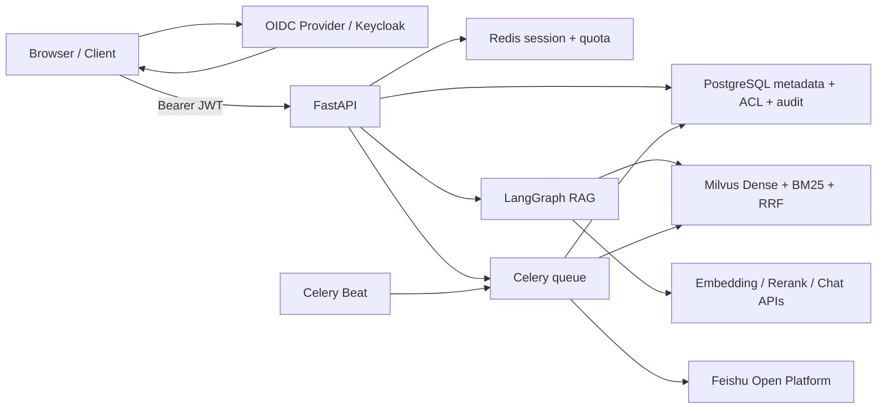

# RAG Study Helper Enterprise

这是参照根目录 Java 学习版的产品思路，重新设计并实现的 Python 企业级 RAG 后端。旧项目只用于提炼有效能力，不作为新项目的接口兼容目标，也不会把旧实现中的启动时扫描、HTTP 200 业务错误、直接信任代理头和跨存储破坏性替换照搬过来。

## 已实现能力

- FastAPI REST、真实 token 级 SSE、OpenAPI、RFC Problem Details、请求 ID 和 Prometheus 指标。
- 提供商无关的 OIDC/JWT Bearer 认证：Discovery + JWKS、签名轮换、issuer/audience/时间强校验，并将 tenant、roles、groups 映射为统一请求身份。
- LangGraph 显式 `rewrite_query → hybrid_retrieve → rerank → expand_context → generate` 工作流；先重排小块，再扩展父级上下文。
- PostgreSQL 保存文档 section、atomic、retrieval、parent 层级关系以及权限、会话、任务和审计事实，全部由 Alembic 管理。
- Milvus 使用 Dense Vector + 内置 BM25 双路召回和 RRF 融合，并按租户、知识库过滤；PostgreSQL 会过滤失效向量版本。
- 外部 rerank 支持可配置短重试、失败分类和 RRF fallback；在线链路暴露 Prometheus operation/attempt/latency 指标，离线评测保存 retry/fallback 比例。
- 蓝绿向量索引重建：构建新物理集合、写入完成后原子切换 Milvus alias，并保留有限回滚版本。
- Redis 原子令牌桶，同时限制用户/租户分钟速率和每日配额；Redis 故障默认拒绝高成本聊天请求。
- Celery 异步解析、embedding、删除、受控目录扫描、索引重建和飞书同步；每个 Worker 子进程复用持久异步事件循环。
- PostgreSQL 部分唯一索引保证同一文档和全量重建只能存在一个活动任务；Worker 使用 advisory lock 协调文档任务与全量索引切换，Celery 重投复用同一目标索引版本。
- 内置 RAG 自动评测：评测数据集、标准问答、异步批量运行、配置快照和逐用例报告；确定性计算 Recall@K、MRR、引用、严格关键点、同义组关键点、引用证据支撑、拒答与延迟指标。
- 文档解析支持 TXT、Markdown、CSV、JSON、XML、PDF、DOCX（含表格）、PPTX、XLSX/XLSM、旧版 XLS、HTML。
- 结构优先、上下文感知的多粒度分块：保留 Markdown/HTML/DOCX 标题层级和页码/幻灯片/工作表元数据；语义边界可配置，embedding 文本自动补充文档与章节上下文。
- 批量 embedding 失败后逐条重试；默认任一分块失败就保留旧索引并标记任务失败，可显式开启部分入库。
- 飞书 Wiki 增量同步支持新版文档、电子表格和多维表格；基于远端更新时间/内容校验跳过未变化内容，并清理远端已删除文档。

详细设计见 [架构说明](docs/architecture.md) 和 [旧项目能力取舍](docs/legacy-reference.md)。

## 架构



## 版本基线（2026-07-10 实际核对）

应用依赖固定在 `pyproject.toml`，容器镜像固定在 `infra/versions.env`。Milvus 的 etcd 与 MinIO 使用 Milvus 2.6.19 官方 standalone 编排的兼容组合。

| 组件 | 版本 |
| --- | --- |
| Python 容器 | 3.13.13 |
| FastAPI / Uvicorn | 0.139.0 / 0.51.0 |
| LangChain / LangGraph | 1.3.12 / 1.2.9 |
| SQLAlchemy / Alembic | 2.0.51 / 1.18.5 |
| Celery / redis-py | 5.6.3 / 6.4.0 |
| pydantic-settings | 2.14.2 |
| PyJWT / Keycloak | 2.13.0 / 26.7.0 |
| PostgreSQL / Redis Server | 18.4 / 8.8.0 |
| Milvus / PyMilvus | 2.6.19 / 2.6.16 |
| python-pptx / xlrd | 1.0.2 / 2.0.2 |
| prometheus-client | 0.25.0 |

主要版本证据：[Python 3.13.13](https://www.python.org/downloads/release/python-31313/)、[Milvus 2.6.19](https://github.com/milvus-io/milvus/releases/tag/v2.6.19)、[Milvus 官方 Compose](https://github.com/milvus-io/milvus/releases/download/v2.6.19/milvus-standalone-docker-compose.yml)、[Keycloak 26.7.0](https://www.keycloak.org/downloads)、[PyJWT 2.13.0](https://pypi.org/project/PyJWT/)、[python-pptx](https://pypi.org/project/python-pptx/)、[xlrd](https://pypi.org/project/xlrd/)、[prometheus-client](https://pypi.org/project/prometheus-client/)。Python 3.13.14 虽已发布，但本次实际构建时 Docker registry 没有可解析的 `3.13.14-slim-bookworm` manifest，因此采用最新可部署标签 3.13.13。

## Windows 初始化（不污染系统 Python）

```powershell
cd enterprise-rag
powershell -ExecutionPolicy Bypass -File .\scripts\bootstrap.ps1
```

脚本只创建本目录下的 `.venv`。依赖、测试工具和命令均从该虚拟环境运行。

## 本地开发启动

```powershell
Copy-Item .\infra\.env.example .\infra\.env
# 确保根目录 .env 与 infra/.env 的 PostgreSQL、Redis 密码一致
powershell -ExecutionPolicy Bypass -File .\scripts\up.ps1
```

`up.ps1` 只启动 PostgreSQL、Redis、etcd、MinIO、Milvus 和本地 Keycloak，不构建 Python 应用镜像。FastAPI、Celery Worker 和 Beat 都从项目内 `.venv` 运行，代码修改无需重建 Docker 镜像。

所有 `APP_*` 应用配置、模型密钥和身份密钥统一放在根目录 `.env`。`infra/.env` 只保存 PostgreSQL、Redis、MinIO 等 Docker 中间件变量；开发脚本无需额外导入密钥。

分别打开终端运行：

```powershell
# 终端 1：自动执行 Alembic，然后启动热重载 API
powershell -ExecutionPolicy Bypass -File .\scripts\dev-api.ps1

# 终端 2：Windows 本地开发使用稳定的 solo pool
powershell -ExecutionPolicy Bypass -File .\scripts\dev-worker.ps1

# 终端 3：只有验证定时任务时才需要
powershell -ExecutionPolicy Bypass -File .\scripts\dev-beat.ps1
```

开发环境检查：

```powershell
powershell -ExecutionPolicy Bypass -File .\scripts\dev-check.ps1
```

`infra/compose.yml` 仍保留完整容器化部署定义，集成测试或部署时可以显式运行完整 Compose；日常开发不使用其中的 `api`、`worker`、`beat`、`migrate` 服务。

服务入口：

- OpenAPI：http://127.0.0.1:8000/docs
- 存活检查：http://127.0.0.1:8000/health/live
- 就绪检查：http://127.0.0.1:8000/health/ready
- Prometheus：http://127.0.0.1:8000/metrics
- Milvus：http://127.0.0.1:19530
- MinIO Console：http://127.0.0.1:9001
- Redis 宿主机端口：`127.0.0.1:16379`
- Keycloak：http://127.0.0.1:18080（Realm：`enterprise-rag`）

停止中间件：

```powershell
powershell -ExecutionPolicy Bypass -File .\scripts\down.ps1
```

## 关键配置

本地应用直接读取根目录 `.env`；Compose 同时读取根 `.env` 的应用配置和 `infra/.env` 的中间件配置。常用配置：

- `APP_CHAT_*`、`APP_EMBEDDING_*`、`APP_RERANK_*`：OpenAI-compatible 模型接口。
- `APP_AUTH_MODE=oidc`：正式认证模式；API 只接受 Bearer Access Token。
- `APP_OIDC_ISSUER`、`APP_OIDC_AUDIENCE`：强制校验 Token 签发者和目标 API；OIDC 模式下均不可为空。
- `APP_OIDC_ALGORITHMS=["RS256"]`：签名算法白名单，禁止 `alg=none`。
- `APP_OIDC_TENANT_CLAIM`、`APP_OIDC_ROLES_CLAIM`、`APP_OIDC_GROUPS_CLAIM`：身份与权限 claims 映射。
- `APP_IDENTITY_HEADER_SECRET`：仅在显式 `APP_AUTH_MODE=trusted_header` 的内部网关兼容模式使用。
- `APP_ADMIN_USER_IDS`：允许触发全量索引重建的用户 ID 集合。
- `APP_SCAN_ROOTS`：可扫描目录别名映射；接口不能提交任意磁盘路径。
- `APP_ALLOW_PARTIAL_INGESTION=false`：默认不接受缺失分块的部分索引。
- `APP_ATOMIC_CHUNK_MAX_TOKENS=160`：句子、段落、表格行等最小语义单元上限。
- `APP_RETRIEVAL_CHUNK_TARGET_TOKENS=320`、`APP_RETRIEVAL_CHUNK_OVERLAP_TOKENS=48`：实际写入 Milvus 并参与召回的子块。
- `APP_PARENT_CHUNK_MAX_TOKENS=960`：rerank 后用于生成阶段扩展的父级块。
- `APP_EMBEDDING_CONTEXT_MAX_TOKENS=400`：包含文档名、章节路径和位置元数据的 embedding 输入预算，适配当前 512-token 级 BGE 模型。
- `APP_RERANK_TIMEOUT_SECONDS=30`、`APP_RERANK_MAX_ATTEMPTS=2`：只对瞬时网络、429 和 5xx 做一次短重试，失败后快速回退 RRF。
- `APP_SEMANTIC_CHUNKING_ENABLED=true`、`APP_SEMANTIC_BREAK_PERCENTILE=15`：只把相邻 atomic 中差异最大的少量位置作为语义断点，避免过度切碎。
- `APP_CONTEXT_NEIGHBOR_WINDOW=1`：rerank 后扩展命中父节及前后相邻章节，再受总 token 预算限制。
- `APP_CONTEXT_DOCUMENT_DIVERSITY_ENABLED=true`、`APP_CONTEXT_DOCUMENT_DIVERSITY_MIN_SCORE_RATIO=0.1`：上下文先覆盖分数达到最高 rerank 分数 10% 的不同文档，再补同文档 parent，避免重复 chunk 挤掉跨文档证据，同时不提升极低分噪声。
- 生成阶段使用版本化的 `citation-integrity-v1` 引用完整性策略：保持已经验证的回答提示不变，仅严格解析精确来源；无效、歧义、不精确和连续重复标记会进入 API/评测诊断。
- `APP_FEISHU_*`：飞书应用、空间、租户和目标知识库配置。

默认本地配置使用 OIDC/JWT。FastAPI 通过 Discovery/JWKS 验证 Access Token 的签名、`iss`、`aud`、`exp`、`iat` 和 `sub`；`aud` 必须包含 `enterprise-rag-api`。OIDC 模式明确拒绝 `X-Tenant-Id`、`X-User-Id` 和 `X-Identity-Secret`，避免客户端伪造租户或用户。`trusted_header` 只作为受保护 API Gateway 的兼容部署模式保留。

获取本地开发 Token：

```powershell
$token = powershell -ExecutionPolicy Bypass -File .\scripts\dev-token.ps1
Invoke-RestMethod http://127.0.0.1:8000/api/v1/auth/me `
  -Headers @{ Authorization = "Bearer $token" }
```

内置账号和 Direct Access Grant 只用于开发验证。正式浏览器前端应使用 Authorization Code Flow + PKCE。认证设计与真实 Token 验证见 [`docs/authentication/oidc-jwt-validation-2026-07-13.md`](docs/authentication/oidc-jwt-validation-2026-07-13.md)。

## API

| 方法 | 路径 | 说明 |
| --- | --- | --- |
| `GET` | `/api/v1/auth/me` | 返回已验证的当前用户、租户、角色、群组和认证方式 |
| `GET/POST` | `/api/v1/knowledge-bases` | 查询可访问知识库、创建受限知识库 |
| `PUT` | `/api/v1/knowledge-bases/{id}/members` | Owner 添加或更新用户/群组权限 |
| `POST` | `/api/v1/documents` | 上传并创建异步入库任务 |
| `POST` | `/api/v1/documents/scan` | 扫描配置好的目录别名 |
| `GET` | `/api/v1/documents` | 只返回有权访问的知识库文档 |
| `POST` | `/api/v1/documents/{id}/reindex` | 保留文档 ID，按当前分块/索引策略重新入库 |
| `DELETE` | `/api/v1/documents/{id}` | 异步删除文档和向量 |
| `POST` | `/api/v1/chat` | 非流式 LangGraph RAG |
| `POST` | `/api/v1/chat/stream` | SSE：`metadata`、`stage`、`token`、`done/error` |
| `GET` | `/api/v1/jobs/{id}` | 查询异步任务 |
| `POST` | `/api/v1/jobs/rebuild-index` | 管理员触发蓝绿重建 |
| `GET/POST` | `/api/v1/evaluations/datasets` | 查询或创建评测数据集 |
| `POST` | `/api/v1/evaluations/datasets/{id}/cases` | 添加单条标准评测用例 |
| `POST` | `/api/v1/evaluations/datasets/{id}/cases/bulk` | 批量添加标准评测用例 |
| `POST` | `/api/v1/evaluations/runs` | 创建 Celery 异步评测运行 |
| `GET` | `/api/v1/evaluations/runs/{id}` | 查询评测进度和汇总指标 |
| `GET` | `/api/v1/evaluations/runs/{id}/report` | 查询逐用例评测报告 |
| `POST` | `/api/v1/evaluations/runs/{id}/recalculate` | 不调用模型，按当前确定性规则重算已有结果指标 |
| `POST` | `/api/v1/evaluations/runs/{candidate_id}/compare` | 对比基线与候选运行的指标、配置差异 |
| `POST` | `/api/v1/evaluations/runs/{candidate_id}/gate` | 执行质量门禁；回退时返回 HTTP 409 |

## RAG 自动评测

评测数据集必须绑定一个知识库。创建数据集、写入用例和发起运行需要该知识库的 `editor` 权限，查看结果需要 `reader` 权限。可回答用例必须填写至少一个已经入库且状态为 `ready` 的预期文档；拒答用例不能填写预期文档。

```json
{
  "question": "Milvus 为什么适合企业知识库？",
  "reference_answer": "Milvus 支持大规模向量检索和分布式部署。",
  "expected_document_ids": ["文档 UUID"],
  "acceptable_citation_document_ids": ["文档 UUID", "可选支持文档 UUID"],
  "required_key_points": ["大规模向量检索", "分布式部署"],
  "required_key_point_groups": [
    ["大规模向量检索", "海量向量检索"],
    ["分布式部署", "分布式扩展"]
  ],
  "should_refuse": false,
  "tags": ["milvus", "architecture"]
}
```

`expected_document_ids` 表示必须召回的权威主文档，用于 Recall/MRR；`acceptable_citation_document_ids` 表示允许答案引用的直接支持文档，只用于 Citation Precision。主文档会自动并入允许引用集合。`required_key_points` 保留严格字面覆盖率，`required_key_point_groups` 中每个内层数组表示一组等价表述，任意一个别名命中即视为该组命中。每组必须包含且只包含一个严格关键点；没有显式填写同义组的严格关键点会自动补成单元素组，因此两个指标的分母一致，可以长期并行比较。

每次运行固定保存当时的聊天模型、embedding、rerank、TopK、阈值和分块参数。评测结果还会保存答案实际引用的父级/相邻章节证据快照，使用关键点同义组计算 `citation_grounded_key_point_coverage`、`citation_key_point_support_rate` 和 `citation_required_point_support_precision`。这些指标用于区分“引用了 ground truth 之外但确实支持结论的资料”和“只提供背景、未支撑必答关键点的冗余引用”。第一版不使用 LLM-as-Judge，避免评测结果受额外模型随机性和成本影响；后续可在同一结果模型上增加可选裁判模型。

运行对比请求：

```json
{
  "baseline_run_id": "基线运行 UUID"
}
```

默认质量门禁不允许 Retrieval/Rerank/Citation Recall 和拒答准确率下降；关键点覆盖、引用支撑率最多下降 `0.02`；首 token 延迟最多增加 `25%`，总延迟最多增加 `20%`；候选运行必须零失败。`/gate` 支持在请求中通过 `thresholds` 覆盖这些值，失败时返回 HTTP 409，Problem Details 的 `data` 字段包含逐指标检查结果，可直接用于 CI/CD 阻止发布。

首份真实评测集见 [`docs/evaluation-datasets/project-architecture-v1.json`](docs/evaluation-datasets/project-architecture-v1.json)，对应基线报告见 [`docs/evaluation-baselines/project-architecture-v1-2026-07-11.md`](docs/evaluation-baselines/project-architecture-v1-2026-07-11.md)。

多粒度混合检索 V2 报告见 [`docs/evaluation-baselines/project-architecture-v2-2026-07-12.md`](docs/evaluation-baselines/project-architecture-v2-2026-07-12.md)。

HTML metadata 与答案实际引用优化后的 V2.1 报告见 [`docs/evaluation-baselines/project-architecture-v2.1-2026-07-12.md`](docs/evaluation-baselines/project-architecture-v2.1-2026-07-12.md)。

rerank 重试、fallback 与监控验证见 [`docs/evaluation-baselines/project-architecture-v2.2-2026-07-12.md`](docs/evaluation-baselines/project-architecture-v2.2-2026-07-12.md)。

检索主文档与允许引用文档分离后的审计见 [`docs/evaluation-baselines/project-architecture-v2.3-2026-07-12.md`](docs/evaluation-baselines/project-architecture-v2.3-2026-07-12.md)。

不复用原说明文档和问题、直接使用 10 份实现源码进行的独立验证见 [`docs/evaluation-baselines/source-code-holdout-v1-2026-07-12.md`](docs/evaluation-baselines/source-code-holdout-v1-2026-07-12.md)，对应固定数据包为 [`docs/evaluation-datasets/source-code-holdout-v1.json`](docs/evaluation-datasets/source-code-holdout-v1.json)。

文档多样性上下文排序的 Control、Naive 与 10% 分数门槛消融，以及项目架构回归结果见 [`docs/evaluation-baselines/context-document-diversity-ablation-2026-07-13.md`](docs/evaluation-baselines/context-document-diversity-ablation-2026-07-13.md)。

拒答检测对“讨论拒答机制”元问题的修复和四个历史运行的无模型重算结果见 [`docs/evaluation-baselines/refusal-detection-recalculation-2026-07-13.md`](docs/evaluation-baselines/refusal-detection-recalculation-2026-07-13.md)。

严格关键点与人工审计同义组的双指标设计、四个历史运行的无模型回算结果见 [`docs/evaluation-baselines/key-point-group-audit-2026-07-13.md`](docs/evaluation-baselines/key-point-group-audit-2026-07-13.md)。

引用证据快照、关键点支撑指标和 Citation Precision 剩余误差拆分见 [`docs/evaluation-baselines/citation-evidence-grounding-2026-07-13.md`](docs/evaluation-baselines/citation-evidence-grounding-2026-07-13.md)。

最少充分引用策略、分数过滤否决实验和结构诊断设计见 [`docs/evaluation-baselines/minimal-sufficient-citation-policy-2026-07-13.md`](docs/evaluation-baselines/minimal-sufficient-citation-policy-2026-07-13.md)。

真实运行对比、默认质量门禁规则以及 v1/v2 自动拒绝结果见 [`docs/evaluation-baselines/quality-gate-validation-2026-07-13.md`](docs/evaluation-baselines/quality-gate-validation-2026-07-13.md)。

## 飞书同步

启用 `APP_FEISHU_ENABLED=true` 后，Celery Beat 每 12 小时触发一次同步。同步流程为：递归读取 Wiki 节点 → 获取 docx/sheet/bitable 内容 → 对比 `source_key` 与更新时间/校验和 → 只排队变化文档 → 为远端消失节点创建删除任务。Redis 分布式锁防止多个 Beat/Worker 重复同步。

官方接口依据：[Wiki 子节点列表](https://open.feishu.cn/document/server-docs/docs/wiki-v2/space-node/list?lang=zh-CN)、[文档纯文本](https://open.feishu.cn/document/server-docs/docs/docs/docx-v1/document/raw_content?lang=zh-CN)、[电子表格](https://open.feishu.cn/document/server-docs/docs/sheets-v3/spreadsheet-sheet/query)、[多维表格记录](https://open.feishu.cn/document/server-docs/docs/bitable-v1/app-table-record/list?lang=zh-CN)。

## 验证

```powershell
.\.venv\Scripts\python -m pytest -q
.\.venv\Scripts\python -m ruff check app tests migrations
.\.venv\Scripts\python -m mypy app
.\.venv\Scripts\python -m pip check
docker compose --env-file .\infra\versions.env --env-file .\infra\.env --env-file .\.env -f .\infra\compose.yml config --quiet
```

当前验证结果：72 个测试通过，Ruff、mypy、pip check、Alembic 迁移和 Compose 配置通过。开发模式由本地 `.venv` 运行 API/Worker/Beat，Docker 运行 PostgreSQL、Redis、Milvus、etcd、MinIO 和 Keycloak。蓝绿重建、权限授权、OIDC/JWT、Audience 强校验、群组 ACL、目录扫描、任务失败补偿、异步删除、并发任务唯一约束、advisory lock、真实源码 holdout、上下文多样性消融、引用证据审计、引用策略 A/B 和质量门禁均已做端到端验证。

模型密钥不属于仓库；本地 `.venv` 与完整 Compose 部署都从根目录 `.env` 读取应用配置，`infra/.env` 仅保存中间件变量。生产上线应把本地 Keycloak 配置替换为企业 IdP、启用 HTTPS 和 Authorization Code Flow + PKCE，并补充密钥管理、备份策略与压测；这些是部署环境能力，不应硬编码进本仓库。
