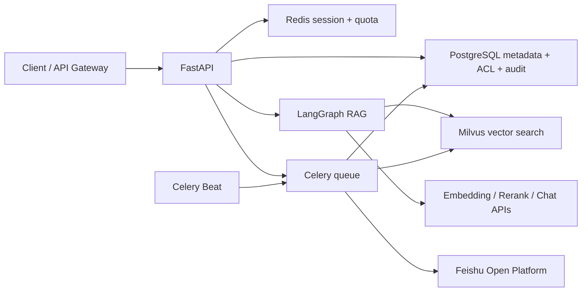

# RAG Study Helper Enterprise

这是参照根目录 Java 学习版的产品思路，重新设计并实现的 Python 企业级 RAG 后端。旧项目只用于提炼有效能力，不作为新项目的接口兼容目标，也不会把旧实现中的启动时扫描、HTTP 200 业务错误、直接信任代理头和跨存储破坏性替换照搬过来。

## 已实现能力

- FastAPI REST、真实 token 级 SSE、OpenAPI、RFC Problem Details、请求 ID 和 Prometheus 指标。
- LangGraph 显式 `rewrite_query → retrieve → rerank → generate` 工作流；只有短问题或指代问题才调用模型改写。
- PostgreSQL 知识库、成员权限、文档、分块、会话、消息、任务和审计模型，全部由 Alembic 管理。
- Milvus 按租户和知识库双重过滤；文档索引带版本号，PostgreSQL 会过滤失效向量版本。
- 蓝绿向量索引重建：构建新物理集合、写入完成后原子切换 Milvus alias，并保留有限回滚版本。
- Redis 原子令牌桶，同时限制用户/租户分钟速率和每日配额；Redis 故障默认拒绝高成本聊天请求。
- Celery 异步解析、embedding、删除、受控目录扫描、索引重建和飞书同步；每个 Worker 子进程复用持久异步事件循环。
- 内置 RAG 自动评测：评测数据集、标准问答、异步批量运行、配置快照和逐用例报告；确定性计算 Recall@K、MRR、引用、关键点、拒答与延迟指标。
- 文档解析支持 TXT、Markdown、CSV、JSON、XML、PDF、DOCX（含表格）、PPTX、XLSX/XLSM、旧版 XLS、HTML。
- 批量 embedding 失败后逐条重试；默认任一分块失败就保留旧索引并标记任务失败，可显式开启部分入库。
- 飞书 Wiki 增量同步支持新版文档、电子表格和多维表格；基于远端更新时间/内容校验跳过未变化内容，并清理远端已删除文档。

详细设计见 [架构说明](docs/architecture.md) 和 [旧项目能力取舍](docs/legacy-reference.md)。

## 架构



## 版本基线（2026-07-10 实际核对）

应用依赖固定在 `pyproject.toml`，容器镜像固定在 `infra/versions.env`。Milvus 的 etcd 与 MinIO 使用 Milvus 2.6.19 官方 standalone 编排的兼容组合。

| 组件 | 版本 |
| --- | --- |
| Python 容器 | 3.13.13 |
| FastAPI / Uvicorn | 0.139.0 / 0.51.0 |
| LangChain / LangGraph | 1.3.12 / 1.2.9 |
| SQLAlchemy / Alembic | 2.0.51 / 1.18.5 |
| Celery / redis-py | 5.6.3 / 6.4.0 |
| pydantic-settings | 2.14.2 |
| PostgreSQL / Redis Server | 18.4 / 8.8.0 |
| Milvus / PyMilvus | 2.6.19 / 2.6.16 |
| python-pptx / xlrd | 1.0.2 / 2.0.2 |
| prometheus-client | 0.25.0 |

主要版本证据：[Python 3.13.13](https://www.python.org/downloads/release/python-31313/)、[Milvus 2.6.19](https://github.com/milvus-io/milvus/releases/tag/v2.6.19)、[Milvus 官方 Compose](https://github.com/milvus-io/milvus/releases/download/v2.6.19/milvus-standalone-docker-compose.yml)、[python-pptx](https://pypi.org/project/python-pptx/)、[xlrd](https://pypi.org/project/xlrd/)、[prometheus-client](https://pypi.org/project/prometheus-client/)。Python 3.13.14 虽已发布，但本次实际构建时 Docker registry 没有可解析的 `3.13.14-slim-bookworm` manifest，因此采用最新可部署标签 3.13.13。

## Windows 初始化（不污染系统 Python）

```powershell
cd enterprise-rag
powershell -ExecutionPolicy Bypass -File .\scripts\bootstrap.ps1
```

脚本只创建本目录下的 `.venv`。依赖、测试工具和命令均从该虚拟环境运行。

## 启动完整环境

```powershell
Copy-Item .\infra\.env.example .\infra\.env
# 修改数据库、Redis、MinIO 密码；需要入库/问答时填写模型 API key
powershell -ExecutionPolicy Bypass -File .\scripts\up.ps1
```

服务入口：

- OpenAPI：http://127.0.0.1:8000/docs
- 存活检查：http://127.0.0.1:8000/health/live
- 就绪检查：http://127.0.0.1:8000/health/ready
- Prometheus：http://127.0.0.1:8000/metrics
- Milvus：http://127.0.0.1:19530
- MinIO Console：http://127.0.0.1:9001
- Redis 宿主机端口：`127.0.0.1:16379`

停止：

```powershell
powershell -ExecutionPolicy Bypass -File .\scripts\down.ps1
```

## 关键配置

本地运行读取 `.env`，Compose 读取 `infra/.env`。常用配置：

- `APP_CHAT_*`、`APP_EMBEDDING_*`、`APP_RERANK_*`：OpenAI-compatible 模型接口。
- `APP_IDENTITY_HEADER_SECRET`：可信 API 网关向后端透传身份时使用；`production` 环境不允许为空。
- `APP_ADMIN_USER_IDS`：允许触发全量索引重建的用户 ID 集合。
- `APP_SCAN_ROOTS`：可扫描目录别名映射；接口不能提交任意磁盘路径。
- `APP_ALLOW_PARTIAL_INGESTION=false`：默认不接受缺失分块的部分索引。
- `APP_CHUNK_SIZE=480`、`APP_CHUNK_OVERLAP=80`：为 512-token 级 embedding 模型保留来源前缀和中英文混排余量。
- `APP_FEISHU_*`：飞书应用、空间、租户和目标知识库配置。

请求身份边界当前为 `X-Tenant-Id`、`X-User-Id` 和可选的 `X-Identity-Secret`。生产环境应由 OIDC/JWT 网关完成认证，后端只信任受保护的内部网络身份头。

## API

| 方法 | 路径 | 说明 |
| --- | --- | --- |
| `GET/POST` | `/api/v1/knowledge-bases` | 查询可访问知识库、创建受限知识库 |
| `PUT` | `/api/v1/knowledge-bases/{id}/members` | Owner 添加或更新用户权限 |
| `POST` | `/api/v1/documents` | 上传并创建异步入库任务 |
| `POST` | `/api/v1/documents/scan` | 扫描配置好的目录别名 |
| `GET` | `/api/v1/documents` | 只返回有权访问的知识库文档 |
| `DELETE` | `/api/v1/documents/{id}` | 异步删除文档和向量 |
| `POST` | `/api/v1/chat` | 非流式 LangGraph RAG |
| `POST` | `/api/v1/chat/stream` | SSE：`metadata`、`stage`、`token`、`done/error` |
| `GET` | `/api/v1/jobs/{id}` | 查询异步任务 |
| `POST` | `/api/v1/jobs/rebuild-index` | 管理员触发蓝绿重建 |
| `GET/POST` | `/api/v1/evaluations/datasets` | 查询或创建评测数据集 |
| `POST` | `/api/v1/evaluations/datasets/{id}/cases` | 添加单条标准评测用例 |
| `POST` | `/api/v1/evaluations/datasets/{id}/cases/bulk` | 批量添加标准评测用例 |
| `POST` | `/api/v1/evaluations/runs` | 创建 Celery 异步评测运行 |
| `GET` | `/api/v1/evaluations/runs/{id}` | 查询评测进度和汇总指标 |
| `GET` | `/api/v1/evaluations/runs/{id}/report` | 查询逐用例评测报告 |

## RAG 自动评测

评测数据集必须绑定一个知识库。创建数据集、写入用例和发起运行需要该知识库的 `editor` 权限，查看结果需要 `reader` 权限。可回答用例必须填写至少一个已经入库且状态为 `ready` 的预期文档；拒答用例不能填写预期文档。

```json
{
  "question": "Milvus 为什么适合企业知识库？",
  "reference_answer": "Milvus 支持大规模向量检索和分布式部署。",
  "expected_document_ids": ["文档 UUID"],
  "required_key_points": ["大规模向量检索", "分布式部署"],
  "should_refuse": false,
  "tags": ["milvus", "architecture"]
}
```

每次运行固定保存当时的聊天模型、embedding、rerank、TopK、阈值和分块参数。第一版不使用 LLM-as-Judge，避免评测结果受额外模型随机性和成本影响；答案忠实度先通过预期文档引用、关键点覆盖和拒答准确率衡量，后续可在同一结果模型上增加可选裁判模型。

首份真实评测集见 [`docs/evaluation-datasets/project-architecture-v1.json`](docs/evaluation-datasets/project-architecture-v1.json)，对应基线报告见 [`docs/evaluation-baselines/project-architecture-v1-2026-07-11.md`](docs/evaluation-baselines/project-architecture-v1-2026-07-11.md)。

## 飞书同步

启用 `APP_FEISHU_ENABLED=true` 后，Celery Beat 每 12 小时触发一次同步。同步流程为：递归读取 Wiki 节点 → 获取 docx/sheet/bitable 内容 → 对比 `source_key` 与更新时间/校验和 → 只排队变化文档 → 为远端消失节点创建删除任务。Redis 分布式锁防止多个 Beat/Worker 重复同步。

官方接口依据：[Wiki 子节点列表](https://open.feishu.cn/document/server-docs/docs/wiki-v2/space-node/list?lang=zh-CN)、[文档纯文本](https://open.feishu.cn/document/server-docs/docs/docs/docx-v1/document/raw_content?lang=zh-CN)、[电子表格](https://open.feishu.cn/document/server-docs/docs/sheets-v3/spreadsheet-sheet/query)、[多维表格记录](https://open.feishu.cn/document/server-docs/docs/bitable-v1/app-table-record/list?lang=zh-CN)。

## 验证

```powershell
.\.venv\Scripts\python -m pytest -q
.\.venv\Scripts\python -m ruff check app tests migrations
.\.venv\Scripts\python -m mypy app
.\.venv\Scripts\python -m pip check
docker compose --env-file .\infra\versions.env --env-file .\infra\.env -f .\infra\compose.yml config --quiet
```

当前验证结果：17 个测试通过，Ruff、mypy、pip check、Alembic 迁移和 Compose 配置通过；API、PostgreSQL、Redis、Milvus、Worker、Beat 均已在 Docker 中运行。蓝绿重建、权限授权、目录扫描、任务失败补偿、异步删除和 25 条真实 RAG 基线评测已做端到端验证。

模型密钥不属于仓库，因此真实 embedding/LLM 内容质量测试需要在 `infra/.env` 填入密钥后执行。生产上线还需要接入企业 IdP/密钥管理、外部 Prometheus/Grafana、备份策略、压测与告警，这些是部署环境能力，不应硬编码进本仓库。
