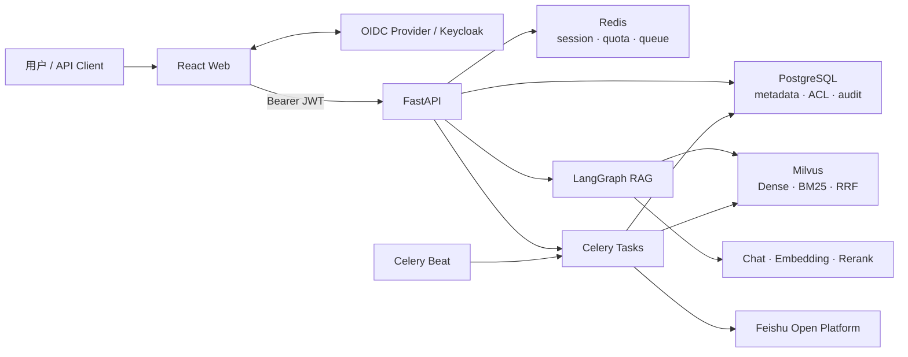

# 📚 RAG Study Helper Enterprise

> 面向企业知识库的多租户 RAG 问答、内容治理与质量评测平台

[](pyproject.toml)
[](pyproject.toml)
[](https://fastapi.tiangolo.com/)
[](frontend/package.json)
[](frontend/package.json)
[](infra/versions.env)
[](infra/compose.yml)
[](https://github.com/WWSS11/enterprise-rag)

从文档接入、分层切分、混合检索和答案生成，到引用核验、自动评测、质量门禁与审计追踪，一个平台完成企业 RAG 的完整闭环。

> 当前版本为 `0.1.0`，处于持续开发阶段。仓库提供完整的本地开发与容器化部署能力；正式上线前仍需按实际环境完成企业 IdP、HTTPS、密钥托管、备份和容量评估。

## 目录

- [项目定位](#项目定位)
- [核心能力](#核心能力)
- [系统架构](#系统架构)
- [快速开始](#快速开始)
- [生产部署](#生产部署)
- [配置说明](#配置说明)
- [API 概览](#api-概览)
- [技术栈](#技术栈)
- [项目结构](#项目结构)
- [开发与验证](#开发与验证)
- [文档导航](#文档导航)
- [安全说明](#安全说明)

## 项目定位

RAG Study Helper Enterprise 不是只封装一次向量检索和大模型调用的演示项目。它面向需要长期运营知识库的团队，将检索效果、权限隔离、异步任务、索引演进、质量评测和可观测性纳入同一套工程体系。

| 适用角色 | 典型需求 | 平台提供的能力 |
| --- | --- | --- |
| 企业研发与知识管理团队 | 让内部文档可检索、可追溯、可授权 | 多知识库、用户/群组 ACL、来源引用与审计日志 |
| AI / RAG 工程师 | 迭代检索与分块策略并量化效果 | 混合召回、Rerank、多粒度上下文、评测集和质量门禁 |
| 平台与运维团队 | 稳定运行文档处理和索引任务 | Celery 异步任务、并发保护、蓝绿索引、健康检查和指标 |
| 合规与安全团队 | 防止跨租户访问并保留操作证据 | OIDC/JWT 强校验、租户隔离、角色权限、请求 ID 和审计事实 |

### 为什么需要完整的 RAG 工程闭环？

一个可上线的知识库问答系统需要处理的不只是“找到相似文本”：

```text
多源文档 → 结构化解析 → 分层切分 → 异步向量化 → 权限过滤
        → 混合召回 → Rerank → 上下文扩展 → 生成与引用
        → 自动评测 → 基线对比 → 质量门禁 → 持续改进
```

本项目把这些阶段建模为明确的服务、数据结构和任务状态，避免把权限、索引与评测逻辑散落在临时脚本中。

## 核心能力

### 🔎 可解释的 RAG 问答

- 使用 LangGraph 编排显式工作流：
  `rewrite_query → hybrid_retrieve → rerank → expand_context → generate`。
- Milvus Dense Vector 与内置 BM25 双路召回，通过 RRF 融合候选结果。
- 先对较小检索块执行 Rerank，再扩展父级章节与相邻上下文，兼顾定位精度和答案完整性。
- 支持真实 token 级 SSE 流式输出，并返回检索阶段、来源引用和证据诊断。
- 外部 Rerank 具备短重试、错误分类和 RRF fallback，避免单一模型服务故障拖垮在线链路。

### 📄 企业知识库治理

- 支持多租户、多知识库，以及用户和群组级 `owner / editor / reader` 权限。
- 支持 TXT、Markdown、CSV、JSON、XML、PDF、DOCX、PPTX、XLSX/XLSM、XLS 和 HTML。
- 结构优先的多粒度切分会保留标题层级、页码、幻灯片和工作表等来源元数据。
- 支持文件上传、受控目录扫描、文档重建、异步删除和飞书 Wiki 增量同步。
- PostgreSQL 保存文档层级、权限、会话、任务、评测和审计事实，使用 Alembic 管理演进。

### 📊 RAG 自动评测与质量门禁

- 管理评测数据集、标准问答、预期文档、允许引用文档、关键点与同义表述组。
- 异步批量运行并固定保存模型、检索、Rerank、分块等配置快照。
- 确定性计算 Recall@K、MRR、引用准确性、关键点覆盖、拒答准确率和延迟指标。
- 保存实际引用证据快照，区分“引用了相关资料”和“引用真正支撑了结论”。
- 支持基线/候选运行对比与 HTTP 409 质量门禁，可接入 CI/CD 阻止效果回退。

### 🛡️ 安全、稳定与可观测

- OIDC Discovery + JWKS 验证 Bearer JWT，强制校验签名、`iss`、`aud` 和时间声明。
- 将 tenant、roles、groups 映射为统一请求身份，默认 OIDC 模式拒绝客户端伪造身份头。
- Redis 原子令牌桶同时限制用户和租户的分钟速率与每日配额。
- Celery 处理解析、Embedding、删除、目录扫描、索引重建、评测和飞书同步。
- 数据库唯一约束与 advisory lock 防止同文档任务、全量重建和重投任务相互破坏。
- 蓝绿构建 Milvus 物理集合，通过 alias 原子切换并保留有限回滚版本。
- 提供健康检查、Prometheus 指标、结构化日志、请求 ID、RFC Problem Details 和审计日志。

## 系统架构



在线问答与离线入库相互解耦：FastAPI 负责认证、授权和在线请求，
Celery Worker 负责耗时任务，PostgreSQL 保存权威业务状态，Milvus 负责检索，
Redis 提供队列、配额和分布式协调。

详细流程见 [架构说明](docs/architecture.md)。

## 快速开始

以下流程适用于 Windows 本地开发。脚本会在项目目录创建 `.venv`，不会污染系统 Python。

### 1. 环境要求

- Python `3.13.x`
- Node.js `24.x` 或当前 LTS
- Docker Desktop（Docker Compose v2）
- PowerShell 5.1 或更高版本
- 可用的 OpenAI-compatible Chat、Embedding 和 Rerank 服务

### 2. 获取代码并初始化

```powershell
git clone https://github.com/WWSS11/enterprise-rag.git
cd enterprise-rag
powershell -ExecutionPolicy Bypass -File .\scripts\dev-setup.ps1
```

初始化脚本会执行以下操作：

1. 创建 `.venv` 并安装 Python 开发依赖；
2. 在 `frontend/` 执行 `npm ci`；
3. 从 example 文件生成缺失的本地配置，但不会覆盖已有配置。

### 3. 配置模型服务

编辑根目录 `.env`，至少填写以下密钥：

```dotenv
APP_CHAT_API_KEY=your_chat_api_key
APP_EMBEDDING_API_KEY=your_embedding_api_key
APP_RERANK_API_KEY=your_rerank_api_key
```

默认示例使用以下 OpenAI-compatible 组合，可在 `.env` 中替换为兼容服务：

| 能力 | 默认示例 |
| --- | --- |
| Chat | DeepSeek `deepseek-chat` |
| Embedding | SiliconFlow `BAAI/bge-large-zh-v1.5` |
| Rerank | SiliconFlow `BAAI/bge-reranker-v2-m3` |

> 更换 Embedding 模型时，必须同步核对 `APP_EMBEDDING_DIMENSION`，并对已有知识库执行索引重建。

### 4. 启动开发环境

```powershell
powershell -ExecutionPolicy Bypass -File .\scripts\dev-up.ps1
```

脚本会启动 PostgreSQL、Redis、etcd、MinIO、Milvus 和 Keycloak，
执行 Alembic 迁移，并在后台启动 FastAPI、Celery Worker、Celery Beat 与 Vite。

| 服务 | 地址 |
| --- | --- |
| Web 控制台 | <http://127.0.0.1:3000> |
| OpenAPI / Swagger UI | <http://127.0.0.1:8000/docs> |
| API 就绪检查 | <http://127.0.0.1:8000/health/ready> |
| Prometheus 指标 | <http://127.0.0.1:8000/metrics> |
| Keycloak | <http://127.0.0.1:18080> |
| MinIO Console | <http://127.0.0.1:9001> |
| Milvus | `127.0.0.1:19530` |

本地 Realm 内置两组仅用于开发验证的账号：

| 角色 | 用户名 | 密码 |
| --- | --- | --- |
| 管理员 | `rag-admin` | `admin_change_me` |
| 普通用户 | `rag-user` | `user_change_me` |

### 5. 停止开发环境

```powershell
# 关闭应用进程和 Docker 中间件，保留数据
powershell -ExecutionPolicy Bypass -File .\scripts\dev-down.ps1

# 仅关闭本地应用进程，保留中间件
powershell -ExecutionPolicy Bypass -File .\scripts\dev-down.ps1 -KeepInfrastructure
```

开发日志位于 `.runtime/logs/`。更多参数和排错方式见 [脚本使用教程](scripts/README.md)。

## 生产部署

仓库提供完整容器部署脚本。生产配置与开发配置相互隔离：

```powershell
Copy-Item .\.env.production.example .\.env.production
Copy-Item .\infra\.env.production.example .\infra\.env.production

# 编辑两个 production 文件后启动
powershell -ExecutionPolicy Bypass -File .\scripts\prod-up.ps1
```

启动脚本会执行安全配置检查、拉取基础镜像、构建前后端、
运行 `alembic upgrade head`，并通过 Compose 健康检查等待全部服务就绪。
迁移成功后 API、Worker 和 Beat 才会启动。

```powershell
# 默认保留数据库和其他持久化数据
powershell -ExecutionPolicy Bypass -File .\scripts\prod-down.ps1
```

部署前必须完成：

- 设置 `APP_ENV=production` 与 `APP_DEBUG=false`；
- 将前端、API 和 OIDC 地址改为真实 HTTPS 地址；
- 修改所有 `CHANGE_ME` 密码并配置真实模型密钥；
- 使用企业 IdP，或部署带外部数据库、HTTPS、反向代理和备份的独立 Keycloak；
- 制定 PostgreSQL、Milvus/MinIO 和 Keycloak 的备份与恢复方案；
- 使用不可变镜像标签，并完成负载、容量和故障恢复验证。

> Compose 内置 Keycloak 使用 `start-dev`，只用于本地或自包含验收，不能直接暴露到公网。

## 配置说明

本地应用读取根目录 `.env`；Compose 同时读取应用配置和
`infra/.env` 的中间件配置。完整字段及默认值见：

- [.env.example](.env.example)
- [infra/.env.example](infra/.env.example)

| 配置组 | 主要变量 | 用途 |
| --- | --- | --- |
| 模型 | `APP_CHAT_*` 等 | 模型地址、密钥、模型名和重试策略 |
| 数据 | `APP_POSTGRES_*`、`APP_REDIS_*`、`APP_MILVUS_*` | 业务数据库、缓存/队列和向量数据库 |
| 检索 | `APP_RETRIEVAL_*` 等 | 召回、融合、过滤与 Rerank 参数 |
| 分块 | `APP_*_CHUNK_*` | Atomic、Retrieval、Parent 多粒度分块 |
| 上下文 | `APP_CONTEXT_*`、`APP_EMBEDDING_CONTEXT_*` | 邻接扩展、文档多样性和 Token 预算 |
| 认证 | `APP_AUTH_MODE`、`APP_OIDC_*` | OIDC/JWT 校验与身份 claims 映射 |
| 企业目录 | `APP_ENTERPRISE_DIRECTORY_*` | Keycloak 用户/群组只读搜索、租户绑定和群组 claim 映射 |
| 配额 | `APP_CHAT_RATE_LIMIT_*`、`APP_CHAT_DAILY_LIMIT_*` | 用户/租户的分钟速率与每日配额 |
| 数据源 | `APP_SCAN_ROOTS`、`APP_FEISHU_*` | 受控目录和飞书知识库同步 |
| 前端 | `VITE_*` | 浏览器可访问的前端、API 与认证地址 |

### 认证模式

- `APP_AUTH_MODE=oidc`：默认和推荐模式，仅接受经过签名与声明校验的 Bearer Access Token。
- `APP_AUTH_MODE=trusted_header`：只用于受保护的内部 API Gateway 兼容场景，必须设置高强度 `APP_IDENTITY_HEADER_SECRET`，且不能对终端用户直接开放。

浏览器前端使用 Authorization Code Flow + PKCE。认证边界和真实 Token 验证记录见 [OIDC/JWT 验证说明](docs/authentication/oidc-jwt-validation-2026-07-13.md)。

## API 概览

完整请求模型、响应模型和在线调试以启动后的 [OpenAPI 文档](http://127.0.0.1:8000/docs) 为准。

| 资源 | 代表性接口 | 说明 |
| --- | --- | --- |
| 身份 | `GET /api/v1/auth/me` | 返回当前租户、用户、角色、群组和认证方式 |
| 知识库 | `/api/v1/knowledge-bases` | 创建、查询、归档知识库，管理成员权限并搜索企业目录主体 |
| 文档 | `/api/v1/documents` | 上传、扫描、查询、原文预览与下载、引用位置核验、重建和异步删除文档 |
| 问答 | `POST /api/v1/chat` | 非流式 LangGraph RAG 问答 |
| 流式问答 | `POST /api/v1/chat/stream` | 返回阶段、Token 与状态 SSE 事件 |
| 会话 | `/api/v1/conversations` | 查询、重命名、归档、恢复会话及读取消息 |
| 任务 | `/api/v1/jobs` | 查询异步任务、取消排队任务、重试失败任务并触发管理员索引重建 |
| 连接器 | `/api/v1/connectors/feishu` | 管理员查看飞书安全配置摘要、运行连通性诊断并启动持久化手动同步 |
| 评测 | `/api/v1/evaluations` | 修改、复制和归档数据集，批量导入用例、运行评测、比较结果和执行门禁 |
| 审计 | `GET /api/v1/audit-logs` | 按权限查询操作审计记录 |

API 错误使用 RFC Problem Details，并在响应头和错误体中保留请求 ID，便于跨服务排查。

## 技术栈

| 层级 | 技术 |
| --- | --- |
| Web | React 19、TypeScript 5.9、Vite 7、React Router、TanStack Query、i18next |
| API | Python 3.13、FastAPI、Pydantic、Uvicorn |
| RAG | LangChain、LangGraph、OpenAI-compatible APIs |
| 数据 | PostgreSQL 18、SQLAlchemy、Alembic |
| 检索 | Milvus 2.6、Dense Vector、BM25、RRF |
| 异步与缓存 | Celery、Redis、Celery Beat |
| 身份 | OIDC、OAuth 2.0、JWT、Keycloak、PKCE |
| 可观测性 | Prometheus、structlog、健康检查、请求 ID |
| 测试 | pytest、Vitest、Testing Library、Playwright、Ruff、mypy、ESLint |
| 部署 | Docker、Docker Compose、Nginx、PowerShell |

后端依赖锁定在 [pyproject.toml](pyproject.toml)，容器镜像基线集中在 [infra/versions.env](infra/versions.env)。

## 项目结构

```text
enterprise-rag/
├── app/
│   ├── api/                 # FastAPI 路由与请求依赖
│   ├── core/                # 配置、日志、错误与指标
│   ├── db/                  # SQLAlchemy 模型与会话
│   ├── rag/                 # LangGraph 状态与问答工作流
│   ├── security/            # OIDC/JWT 与统一身份
│   ├── services/            # 入库、检索、评测、飞书等领域服务
│   └── workers/             # Celery 应用、任务与异步运行时
├── frontend/
│   ├── src/                 # React 控制台、API Client 与组件测试
│   └── e2e/                 # Playwright 端到端测试
├── migrations/              # Alembic 数据库迁移
├── infra/
│   ├── compose.yml          # 完整服务编排
│   ├── keycloak/            # 本地开发 Realm
│   └── versions.env         # 基础镜像版本基线
├── scripts/                 # 开发、部署与迁移入口
├── tests/                   # 后端自动化测试
├── docs/                    # 架构、认证、评测数据与基线报告
├── .env.example             # 开发应用配置模板
├── Dockerfile               # 后端应用镜像
└── pyproject.toml           # Python 项目与工具配置
```

## 开发与验证

### 后端

```powershell
.\.venv\Scripts\python -m pytest -q
.\.venv\Scripts\python -m ruff check app tests migrations
.\.venv\Scripts\python -m mypy app
.\.venv\Scripts\python -m pip check
```

### 前端

```powershell
Set-Location .\frontend
npm run typecheck
npm run lint
npm test
npm run build
Set-Location ..
```

### 端到端测试

先启动开发环境，再执行：

```powershell
Set-Location .\frontend
npm run test:e2e:install
npm run test:e2e
Set-Location ..
```

### Compose 配置校验

```powershell
$env:COMPOSE_APP_ENV_FILE = (Resolve-Path .\.env)
docker compose `
  --env-file .\infra\versions.env `
  --env-file .\infra\.env `
  --env-file .\.env `
  -f .\infra\compose.yml config --quiet
```

数据库初始化和版本升级统一使用 Alembic：

```powershell
# 完整容器环境或新环境
powershell -ExecutionPolicy Bypass -File .\scripts\db-migrate.ps1

# 本地开发环境
powershell -ExecutionPolicy Bypass -File .\scripts\db-migrate.ps1 -Runtime Local
```

## 文档导航

| 文档 | 内容 |
| --- | --- |
| [架构说明](docs/architecture.md) | 问答链路、入库 Saga、蓝绿重建、权限模型和质量门禁 |
| [脚本使用教程](scripts/README.md) | 开发/生产启停、数据库迁移、参数与常见问题 |
| [OIDC/JWT 验证说明](docs/authentication/oidc-jwt-validation-2026-07-13.md) | 认证设计、Token 校验和安全边界 |
| [企业目录搜索](docs/e02-enterprise-directory.md) | Keycloak 用户/群组搜索、最小权限、租户绑定和群组 claim 映射 |
| [评测数据集](docs/evaluation-datasets/) | 可复用的项目架构与源码 holdout 数据包 |
| [评测基线与实验](docs/evaluation-baselines/) | 检索、引用、拒答、消融实验和质量门禁记录 |
| [列表容量复核](docs/e06-list-capacity-review.md) | T15 列表证据、当前延期决策和重新实施阈值 |
| [收尾加固与验收](docs/e07-e10-final-hardening.md) | 三浏览器 E2E、前端拆包、警告清理和许可证门禁结果 |
| [第三方许可证策略](docs/third-party-license-policy.md) | 当前授权边界、SPDX 允许清单和 CI 检查方式 |
| [旧项目能力取舍](docs/legacy-reference.md) | 旧学习版中保留、重构与明确放弃的设计 |
| [前端说明](frontend/README.md) | Web 工程结构、环境变量和前端命令 |

## 安全说明

- 不要提交 `.env`、生产密钥、访问令牌、真实租户数据或数据库备份。
- 示例密码和内置 Keycloak 用户只用于本地开发，不能用于共享或生产环境。
- 生产环境必须启用 HTTPS，并确保 `issuer`、`audience`、回调地址和 CORS 来源精确匹配。
- `APP_SCAN_ROOTS` 应只映射经过批准的目录，接口不能接受任意主机路径。
- 删除数据卷、执行数据库降级或切换 Embedding 维度前，应先完成可恢复备份。
- Redis 故障时高成本问答默认拒绝请求；不要为绕过故障而在生产环境随意启用 fail-open。

如发现安全问题，请优先通过私有渠道联系仓库维护者，不要在公开 Issue 中披露密钥、利用细节或真实数据。

## 参与贡献

欢迎通过 Issue 和 Pull Request 参与改进。提交前建议：

1. 将变更限制在明确的问题范围内；
2. 为行为变化补充或更新测试；
3. 运行后端与前端验证命令；
4. 在 Pull Request 中说明动机、实现、风险和验证结果。

## 许可证

当前仓库尚未提供独立的 `LICENSE` 文件。在许可证明确之前，请勿假定本项目代码可被复制、修改或再分发；如需使用，请先联系仓库维护者取得授权。

第三方依赖按 [第三方许可证策略](docs/third-party-license-policy.md) 执行 SPDX 允许清单和 CI 门禁；对外分发制品时仍需附带适用的许可证、版权和署名声明。

---

如果这个项目对你有帮助，欢迎提交反馈或给仓库一个 ⭐。
