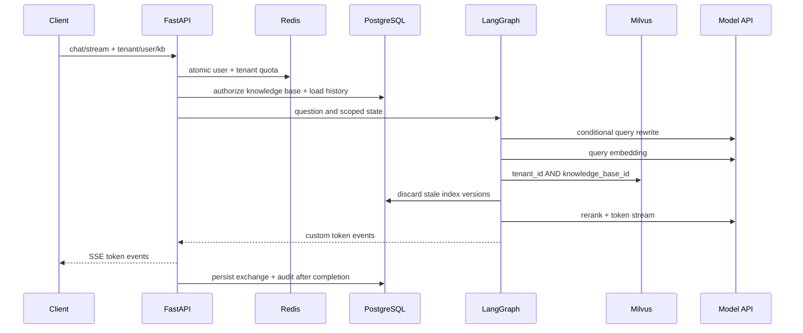

# 架构说明

## 设计边界

系统把 PostgreSQL 作为业务事实源，把 Milvus 作为可重建的检索投影，把 Redis 作为短期状态与协调设施。模型服务、飞书和对象存储均位于外部边界，失败不能破坏 PostgreSQL 中已经可用的文档版本。

## 问答链路

对话消息只在完整回答结束后保存。客户端断开或生成失败会回滚本次交换，不会留下半条 assistant 消息。

## 文档入库 Saga

1. API 计算 SHA-256，在知识库范围内去重，保存文件和 `queued` 任务。
2. Worker 解析结构化 section，保留 PDF 页码、PPT 页、Excel Sheet 等来源元数据。
3. 分块后批量 embedding；批次失败时逐条重试。
4. 以新的 `index_version` 写入 Milvus，但旧版本仍可检索。
5. PostgreSQL 单事务替换 chunk 元数据并切换文档活动版本。
6. 提交成功后清理 Milvus 旧版本；清理失败时，查询链路仍会依据 PostgreSQL 活动版本丢弃陈旧命中。
7. PostgreSQL 提交前失败会补偿删除新向量；已有可用版本的文档恢复为 `ready`。

这种设计不是跨 PostgreSQL/Milvus 的伪分布式事务，而是可恢复、可重试的 Saga。

## 蓝绿重建

全量重建从 PostgreSQL 的活动 chunks 重新生成向量，写入新的 Milvus 物理集合。所有数据写完后通过 `alter_alias` 原子切换 `rag_chunks_current`，旧集合保留有限数量用于快速回滚。构建失败时只删除新集合，不影响线上 alias。

## 权限模型

- 每个文档和会话必须绑定知识库。
- `tenant` 知识库允许同租户使用；`restricted` 知识库必须有成员记录。
- 成员权限为 `reader`、`editor`、`owner`，数据模型保留 `principal_type`，后续可扩展部门和角色。
- Milvus 只按粗粒度租户/知识库过滤，授权事实保存在 PostgreSQL，避免把大量用户 ID 写入向量元数据。
- 当前 Header 身份是网关集成边界，不等同于最终认证实现。

## 异步运行时

Celery prefork 子进程不会为每个任务反复创建事件循环。`app/workers/async_runtime.py` 为每个子进程维护一个持久 loop，使 SQLAlchemy AsyncEngine、redis-py 和异步 HTTP 客户端不会跨 loop 复用 Future。
