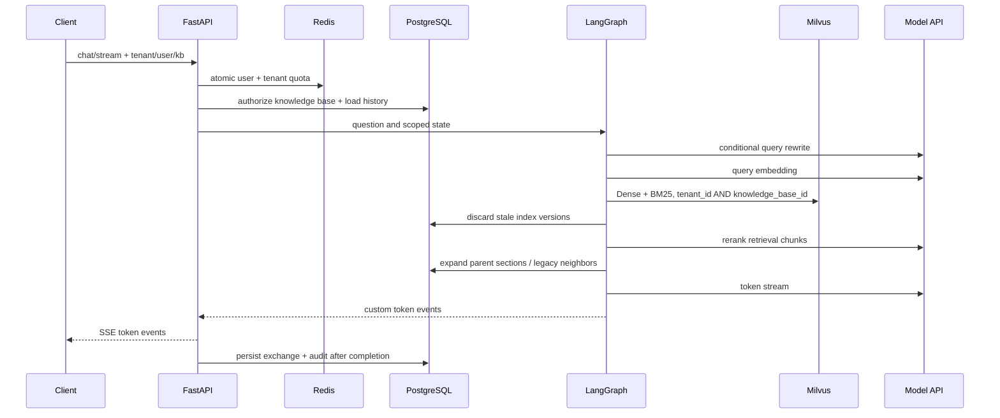

# 架构说明

## 设计边界

系统把 PostgreSQL 作为业务事实源，把 Milvus 作为可重建的检索投影，把 Redis 作为短期状态与协调设施。模型服务、飞书和对象存储均位于外部边界，失败不能破坏 PostgreSQL 中已经可用的文档版本。

## 问答链路

对话消息只在完整回答结束后保存。客户端断开或生成失败会回滚本次交换，不会留下半条 assistant 消息。

## 文档入库 Saga

1. API 计算 SHA-256，在知识库范围内去重，保存文件和 `queued` 任务。
   PostgreSQL 部分唯一索引保证同一文档最多只有一个 `queued/running` 任务。
2. Worker 解析结构化 section，保留标题路径、PDF 页码、PPT 页、Excel Sheet 和表格类型等来源元数据。
3. section 拆成 atomic 单元，再按 token 预算和相邻 embedding 语义边界构建 retrieval chunk 与 parent chunk。
4. retrieval chunk 补充文档名、章节路径和位置上下文后批量 embedding；批次失败时逐条重试。atomic 与 parent 只存 PostgreSQL，不扩大向量索引。
5. 以新的 `index_version` 写入 Milvus，但旧版本仍可检索。
6. PostgreSQL 单事务替换 section、atomic、retrieval 元数据并切换文档活动版本。
7. 提交成功后只按已记录的旧 `index_version` 清理 Milvus，避免并发任务使用“删除除自己以外所有版本”的宽泛条件；清理失败时，查询链路仍会依据 PostgreSQL 活动版本丢弃陈旧命中。
8. PostgreSQL 提交前失败会补偿删除新向量；已有可用版本的文档恢复为 `ready`。

这种设计不是跨 PostgreSQL/Milvus 的伪分布式事务，而是可恢复、可重试的 Saga。

文档入库和删除在 Worker 中持有“索引维护共享 advisory lock + 文档独占 advisory lock”。不同文档可以并行，同一文档只能串行；Worker 异常退出时 PostgreSQL 会自动释放会话锁。Celery late-ack 重投会复用任务中持久化的目标 `index_version`，先清理该版本可能存在的半成品，再继续执行；如果 PostgreSQL 已经发布该版本，则只补齐任务完成状态和旧版本清理。

## 蓝绿重建

全量重建从 PostgreSQL 的活动 chunks 重新生成向量，写入新的 Milvus 物理集合。所有数据写完后通过 `alter_alias` 原子切换 `rag_chunks_current`，旧集合保留有限数量用于快速回滚。构建失败时只删除新集合，不影响线上 alias。全量重建持有索引维护独占 advisory lock，因此不会与文档入库、重新入库或删除交错，避免 alias 切换后遗漏刚发布的文档版本。

## 多粒度检索

Milvus 只索引 retrieval chunk，并通过 Dense Vector 与内置 BM25 各召回一组候选，使用 RRF 融合后交给 reranker。硬相似度阈值默认关闭，避免在 rerank 前误删低 dense 分但关键词准确的结果。完成重排后，系统依据 `parent_section_id` 去 PostgreSQL 扩展父块，并受总 token 数和父块数量双重预算约束；旧索引数据则使用相邻 retrieval chunk 兼容扩展。上下文候选先覆盖 rerank 分数达到最高分 10% 的不同文档，再按原排序补充同文档 parent；低于门槛的噪声不会被多样性策略提前。文档处于 `reindexing` 时仍使用 PostgreSQL 中已经发布的旧 `index_version` 提供检索，只有新版本和元数据在同一事务中发布后才切换。

生成状态区分 `context_sources` 与 `citations`：前者记录实际送入模型的上下文来源，后者只包含答案文本中明确出现的 `[来源:文件名#chunk-N]`。这避免把“模型看过的资料”误报成“答案实际引用的资料”，也使引用精度评测具有明确语义。

引用策略版本为 `citation-integrity-v1`。两轮真实实验表明，直接要求“最少引用”或显式强调证据优先级会降低关键点覆盖，因此默认生成提示保持已经验证的控制版本不变，只增强引用解析和可观测性。解析器不会在同一文件存在多个候选 chunk 时猜测省略 chunk 编号的标记；无效、歧义、不精确和同一连续引用簇内的重复标记分别计入 `citation_diagnostics`，通过聊天 metadata、审计日志和评测结果暴露。同一来源在不同要点中再次就近标注单独计为 `repeated_markers`，不视为违规。评测同时汇总引用标记有效率与更严格的策略合规率，配置快照保存策略版本，使不同策略的运行可比较。

外部 rerank 只对 timeout、传输错误、429 和 5xx 进行一次短重试，仍失败则保留 RRF 顺序继续生成。在线 API 通过 Prometheus 暴露 rerank 请求结果、尝试次数和耗时；Celery 评测进程将 `rerank_status`、尝试次数、fallback 原因写入 EvaluationResult，由报告统计跨进程 retry/fallback 比例。

summary chunk 和独立神经 sparse 模型暂不进入当前主索引：它们保留为后续评测证明有增益后再启用的扩展层，避免与 Milvus BM25 重复召回并增加写入、更新和调参成本。

## 权限模型

- 每个文档和会话必须绑定知识库。
- `tenant` 知识库允许同租户使用；`restricted` 知识库必须有成员记录。
- 成员权限为 `reader`、`editor`、`owner`，数据模型保留 `principal_type`，后续可扩展部门和角色。
- Milvus 只按粗粒度租户/知识库过滤，授权事实保存在 PostgreSQL，避免把大量用户 ID 写入向量元数据。
- 当前 Header 身份是网关集成边界，不等同于最终认证实现。

## 异步运行时

Celery prefork 子进程不会为每个任务反复创建事件循环。`app/workers/async_runtime.py` 为每个子进程维护一个持久 loop，使 SQLAlchemy AsyncEngine、redis-py 和异步 HTTP 客户端不会跨 loop 复用 Future。

本地 Windows 开发时，PostgreSQL、Redis、Milvus、etcd、MinIO 运行在 Docker，FastAPI、Worker、Beat 从项目 `.venv` 运行。Worker 使用 Celery `solo` pool，规避 Windows 对 prefork 支持不完整的问题；容器或 Linux 部署仍使用 `prefork --concurrency=2`。两种模式读取同一套 `APP_*` 配置，但本地 `.env` 使用宿主机端口，`infra/.env` 用于 Compose 中间件密码和镜像编排。

## 自动评测闭环

评测数据集绑定单一知识库，标准用例保存预期文档、严格关键点、关键点同义组和拒答标签。API 创建运行时冻结当前模型、TopK、阈值、分块参数和 Milvus alias，Celery Worker 随后复用同一 LangGraph 工作流逐条执行，但不创建 Conversation、ChatMessage 或普通聊天审计记录。

每条结果保留原始检索顺序、rerank 顺序、引用、答案和延迟，再计算 Recall@K、MRR、引用 precision/recall、严格关键点覆盖率、同义组关键点覆盖率、引用证据支撑率和拒答准确率。严格指标使用原始标注逐字匹配，保证历史趋势稳定；同义组指标允许经过人工审计的自然语言或代码等价表述，避免把 `worker_prefetch_multiplier=1` 与“预取一个”之类的正确答案记为未命中。两者独立保存，不能用同义组分数覆盖严格历史值。

评测运行还会把答案显式引用的 `expanded` 生成上下文保存到 `citation_evidence`，而不是只保存 180 字预览或 retrieval 小块。`citation_grounded_key_point_coverage` 衡量全部必答关键点中有多少同时出现在答案和引用证据中；`citation_key_point_support_rate` 衡量答案已经表达的关键点中有多少得到引用证据支撑；`citation_required_point_support_precision` 衡量被引用 chunk 中有多少至少支撑一个已表达的必答关键点。历史运行没有快照时可根据当时的 rerank chunk、父章节、相邻窗口和配置快照做一次重建，并标记 `reconstructed=true`；新运行直接保存实际送入模型的上下文，结果可重复审计。

拒答检测只检查答案第一结论句，并移除其中的引号内容和 inline code，避免“讨论无法回答这一标记”的元问题被误判成模型拒答。运行可按已经存在的 `run_id + case_id` 结果续跑，避免 Worker 中断后重复消耗全部模型额度。PostgreSQL 保存评测事实，报告 API 只聚合已持久化结果，因此后续增加可选 LLM-as-Judge 或不同检索策略时不需要重做数据模型。

评测用例将检索主文档 `expected_document_ids` 与允许引用文档 `acceptable_citation_document_ids` 分开。前者衡量检索是否找到权威依据，后者衡量答案引用是否落在直接支持材料内，避免为了提升 Citation Precision 而人为放宽 Recall ground truth。

## 运行对比与质量门禁

运行对比只接受同一数据集且状态为 `succeeded` 的基线与候选运行。服务对固定指标集合计算绝对变化、相对变化，并列出配置快照差异，避免把模型、分块、检索或引用策略变化隐藏在单一总分中。

默认门禁规则以“不能用局部优化交换核心质量”为原则：Retrieval/Rerank/Citation Recall 和拒答准确率不允许下降；关键点覆盖与引用支撑允许最多 2 个百分点的波动；首 token 和总延迟分别允许 25% 与 20% 增长；候选必须零失败并满足 Retrieval Recall 0.95、Rerank Recall 0.90、拒答准确率 0.95 的绝对下限。规则通过请求体可覆盖，但每次检查都会写入审计日志。门禁通过返回 200，失败返回 409 与完整检查报告，CI/CD 只需依据 HTTP 状态即可阻止发布。
