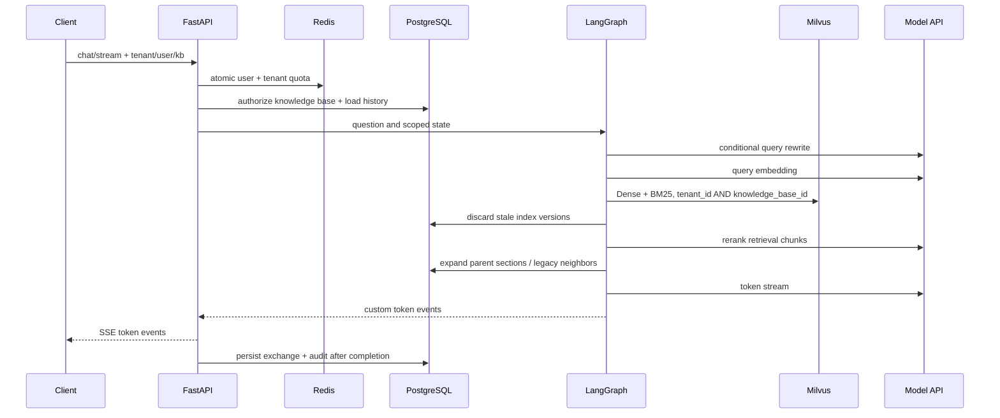

# 架构说明

## 设计边界

系统把 PostgreSQL 作为业务事实源，把 Milvus 作为可重建的检索投影，把 Redis 作为短期状态与协调设施。模型服务、飞书和对象存储均位于外部边界，失败不能破坏 PostgreSQL 中已经可用的文档版本。

## 问答链路

对话消息只在完整回答结束后保存。客户端断开或生成失败会回滚本次交换，不会留下半条 assistant 消息。

## 文档入库 Saga

1. API 计算 SHA-256，在知识库范围内去重，保存文件和 `queued` 任务。
2. Worker 解析结构化 section，保留标题路径、PDF 页码、PPT 页、Excel Sheet 和表格类型等来源元数据。
3. section 拆成 atomic 单元，再按 token 预算和相邻 embedding 语义边界构建 retrieval chunk 与 parent chunk。
4. retrieval chunk 补充文档名、章节路径和位置上下文后批量 embedding；批次失败时逐条重试。atomic 与 parent 只存 PostgreSQL，不扩大向量索引。
5. 以新的 `index_version` 写入 Milvus，但旧版本仍可检索。
6. PostgreSQL 单事务替换 section、atomic、retrieval 元数据并切换文档活动版本。
7. 提交成功后清理 Milvus 旧版本；清理失败时，查询链路仍会依据 PostgreSQL 活动版本丢弃陈旧命中。
8. PostgreSQL 提交前失败会补偿删除新向量；已有可用版本的文档恢复为 `ready`。

这种设计不是跨 PostgreSQL/Milvus 的伪分布式事务，而是可恢复、可重试的 Saga。

## 蓝绿重建

全量重建从 PostgreSQL 的活动 chunks 重新生成向量，写入新的 Milvus 物理集合。所有数据写完后通过 `alter_alias` 原子切换 `rag_chunks_current`，旧集合保留有限数量用于快速回滚。构建失败时只删除新集合，不影响线上 alias。

## 多粒度检索

Milvus 只索引 retrieval chunk，并通过 Dense Vector 与内置 BM25 各召回一组候选，使用 RRF 融合后交给 reranker。硬相似度阈值默认关闭，避免在 rerank 前误删低 dense 分但关键词准确的结果。完成重排后，系统依据 `parent_section_id` 去 PostgreSQL 扩展父块，并受总 token 数和父块数量双重预算约束；旧索引数据则使用相邻 retrieval chunk 兼容扩展。

生成状态区分 `context_sources` 与 `citations`：前者记录实际送入模型的上下文来源，后者只包含答案文本中明确出现的 `[来源:文件名#chunk-N]`。这避免把“模型看过的资料”误报成“答案实际引用的资料”，也使引用精度评测具有明确语义。

summary chunk 和独立神经 sparse 模型暂不进入当前主索引：它们保留为后续评测证明有增益后再启用的扩展层，避免与 Milvus BM25 重复召回并增加写入、更新和调参成本。

## 权限模型

- 每个文档和会话必须绑定知识库。
- `tenant` 知识库允许同租户使用；`restricted` 知识库必须有成员记录。
- 成员权限为 `reader`、`editor`、`owner`，数据模型保留 `principal_type`，后续可扩展部门和角色。
- Milvus 只按粗粒度租户/知识库过滤，授权事实保存在 PostgreSQL，避免把大量用户 ID 写入向量元数据。
- 当前 Header 身份是网关集成边界，不等同于最终认证实现。

## 异步运行时

Celery prefork 子进程不会为每个任务反复创建事件循环。`app/workers/async_runtime.py` 为每个子进程维护一个持久 loop，使 SQLAlchemy AsyncEngine、redis-py 和异步 HTTP 客户端不会跨 loop 复用 Future。

本地 Windows 开发时，PostgreSQL、Redis、Milvus、etcd、MinIO 运行在 Docker，FastAPI、Worker、Beat 从项目 `.venv` 运行。Worker 使用 Celery `solo` pool，规避 Windows 对 prefork 支持不完整的问题；容器或 Linux 部署仍使用 `prefork --concurrency=2`。两种模式读取同一套 `APP_*` 配置，但本地 `.env` 使用宿主机端口，`infra/.env` 用于 Compose 中间件密码和镜像编排。

## 自动评测闭环

评测数据集绑定单一知识库，标准用例保存预期文档、关键点和拒答标签。API 创建运行时冻结当前模型、TopK、阈值、分块参数和 Milvus alias，Celery Worker 随后复用同一 LangGraph 工作流逐条执行，但不创建 Conversation、ChatMessage 或普通聊天审计记录。

每条结果保留原始检索顺序、rerank 顺序、引用、答案和延迟，再计算 Recall@K、MRR、引用 precision/recall、关键点覆盖率和拒答准确率。运行可按已经存在的 `run_id + case_id` 结果续跑，避免 Worker 中断后重复消耗全部模型额度。PostgreSQL 保存评测事实，报告 API 只聚合已持久化结果，因此后续增加可选 LLM-as-Judge 或不同检索策略时不需要重做数据模型。
